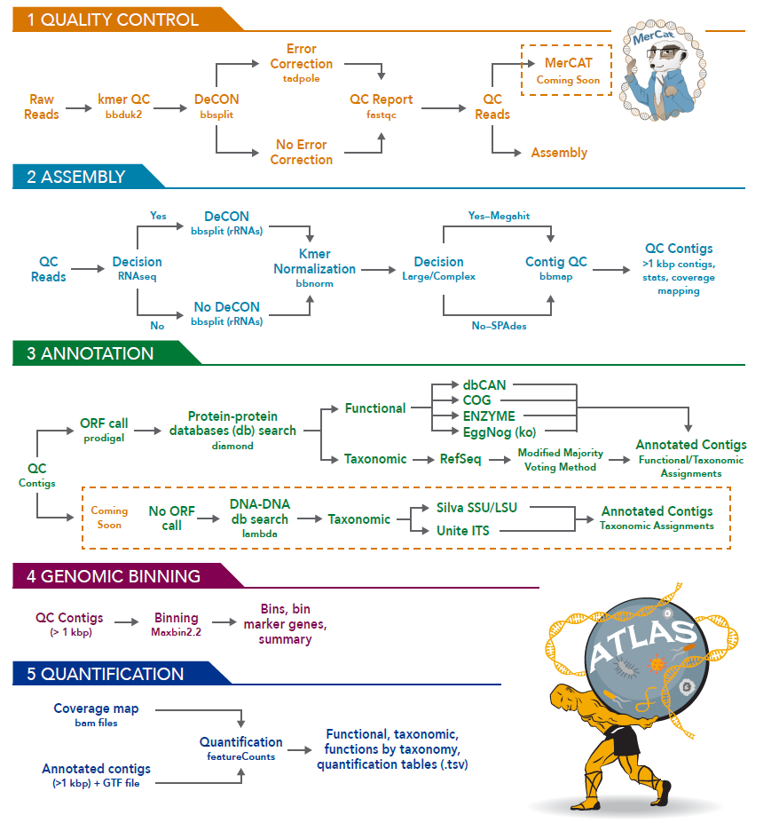

# ATLAS (Automatic Tool for Local Assembly Structures)



# Detailed Manual

[](https://zenodo.org/badge/latestdoi/75199304) [](http://pnnl-atlas.readthedocs.io/en/latest/?badge=latest)
Manual website - https://pnnl-atlas.readthedocs.io

# Install

All dependencies are installed via [conda](https://www.continuum.io/downloads) using the [bioconda](https://github.com/bioconda/bioconda-recipes) channel.
The workflow and some dependencies require Python 3.5.

## Using `conda`

To install:

```
conda install -c bioconda \
    bbmap diamond fastqc megahit prodigal \
    samtools snakemake spades subread
```

Maxbin2 and MEGAHIT for macOS are not current in the bioconda channel. For those dependencies, we've made them available to install as:

```
conda install -c brwnj maxbin2
```

## Creating an Environment

Not necessary, but this can isolate ATLAS dependencies in a separate work
environment. Using `environment.yml`:

```
conda env create -f environment.yml
```

And load and unload that environment using `source activate atlas_env`
and `source deactivate atlas_env`, respectively.

## Finishing the Install

Finally, from within the 'atlas' source folder:

```
python setup.py install
```

Following install, `atlas` should be executable:

```
$ atlas -h
Usage: atlas [OPTIONS] COMMAND [ARGS]...

  ATLAS

Options:
  --version   Show the version and exit.
  -h, --help  Show this message and exit.

Commands:
  assemble      assembly workflow
  download      download reference files
  make-config   prepopulate a configuration file with samples and defaults
```

ATLAS will soon be pushed to the Anaconda Cloud for easier install.


# Getting Started

After installing, one needs to download the required databases and create a sample configuration file.


## Databases

To download the databases and their respective metadata databases:

```
atlas download -o /databases
```

The downloads use approximately 40 GB of disk space.


## Configuration File

To create a simple configuration file (which you can later edit), run:

```
atlas make-config --database-dir /databases config.yaml /my-data
```

In this case, 'my-data' is a directory containing .fastq files similar to:

```
$ tree /my-data
/my-data/
├── Sample-1_R1.fastq.gz
├── Sample-1_R2.fastq.gz
├── Sample-2_R1.fastq.gz
└── Sample-2_R2.fastq.gz
```

Paired-end, single-end (though some file names still suggest otherwise), and
interleaved paired-end FASTQs are supported.


## Assembly

After editing your configuration file and adjusting any additional parameters
we run assemblies across our samples using:

```
atlas assemble config.yaml
```

By default, this will write results into our current working directory across
the total number of CPU cores available.

# Citing ATLAS

If you are publishing results obtained using MerCat, please cite:

Richard Allen White III, Joseph Brown, Sean Colby, Christopher C. Overall, Joon-Yong Lee, Jeremy Zucker, Kurt R. Glaesemann, Christer Jansson, Janet K Jansson. ATLAS (Automatic Tool for Local Assembly Structures) - a comprehensive infrastructure for assembly, annotation, and genomic binning of metagenomic and metatranscriptomic data. PeerJ Preprints 5:e2843v1 https://doi.org/10.7287/peerj.preprints.2843v1.

Richard Allen White III, Joseph Brown, Sean Colby, Christopher C. Overall, Joon-Yong Lee, Jeremy Zucker, Kurt R. Glaesemann, Christer Jansson, Janet K Jansson. ATLAS (Automatic Tool for Local Assembly Structures) - a comprehensive infrastructure for assembly, annotation, and genomic binning of metagenomic and metatranscriptomic data. Bioinformatics. Submitted.

# Disclaimer

This material was prepared as an account of work sponsored by an agency of the
United States Government.  Neither the United States Government nor the United
States Department of Energy, nor Battelle, nor any of their employees, nor any
jurisdiction or organization that has cooperated in the development of these
materials, makes any warranty, express or implied, or assumes any legal
liability or responsibility for the accuracy, completeness, or usefulness or
any information, apparatus, product, software, or process disclosed, or
represents that its use would not infringe privately owned rights.

Reference herein to any specific commercial product, process, or service by
trade name, trademark, manufacturer, or otherwise does not necessarily
constitute or imply its endorsement, recommendation, or favoring by the United
States Government or any agency thereof, or Battelle Memorial Institute. The
views and opinions of authors expressed herein do not necessarily state or
reflect those of the United States Government or any agency thereof.

PACIFIC NORTHWEST NATIONAL LABORATORY operated by BATTELLE for the UNITED
STATES DEPARTMENT OF ENERGY under Contract DE-AC05-76RL01830
