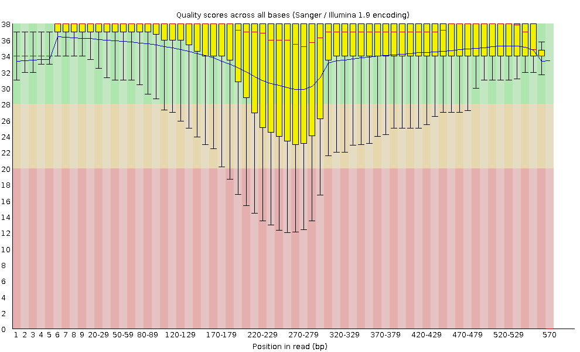
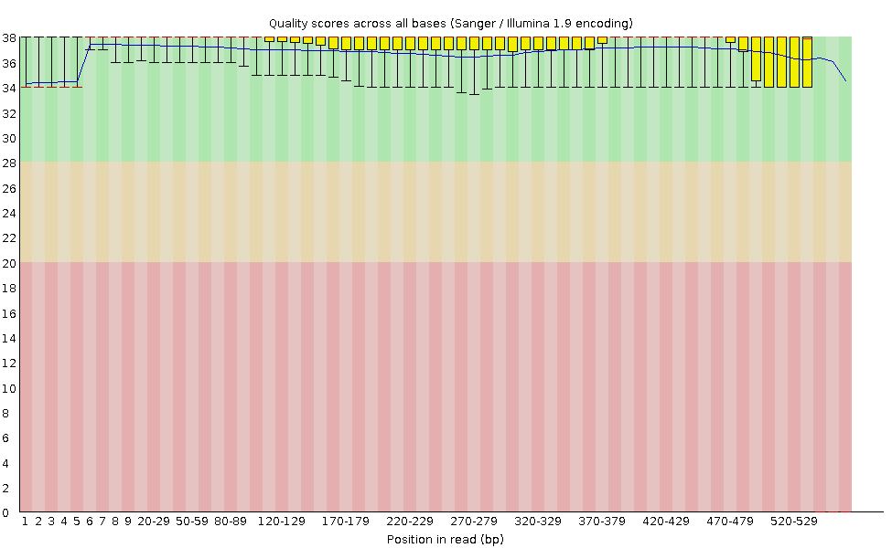
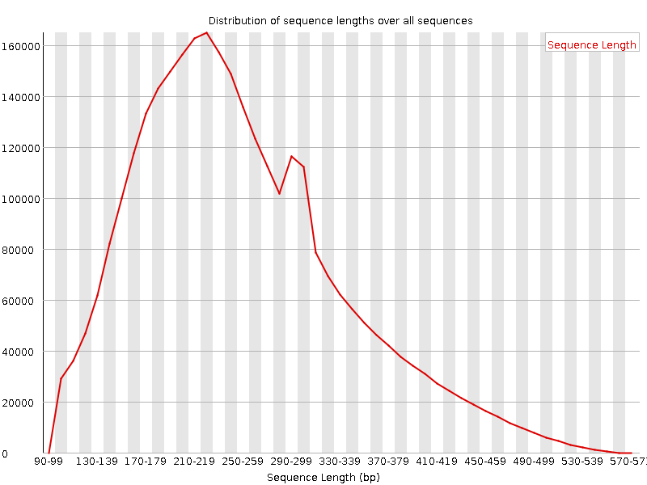

## ATLAS (Automatic Tool for Local Assembly Structures)

# Requirements (and bioconda status)

- [x] bedtools
- [x] bowtie2
- [x] click
- [x] fastqc
- [x] flash
- [ ] fraggenescan (1.30 - which actually doesn't exist) https://github.com/wltrimbl/FGS/releases
- [ ] fraggenescan plus
- [x] hmmer3
- [x] HTSeq
- [x] idba-ud
- [ ] last-plus
- [ ] lcastar-plus
- [ ] maxbin - http://downloads.jbei.org/data/microbial_communities/MaxBin/getfile.php?MaxBin-2.2.1.tar.gz
- [x] megahit
- [ ] perl-lwp-simple - http://search.cpan.org/dist/libwww-perl/lib/LWP/Simple.pm
- [x] picard
- [x] prodigal
- [x] pysam
- [x] python 3
- [x] samtools
- [x] snakemake -- TODO: check on other python deps
- [x] trinity
- [x] trimmomatic
- [x] verse


# Current Protocol

1. Build contaminant DBs
2. Join R1 and R2
3. Decontaminate across DBs
4. Trim the merged reads
5. FastQC on passing trimmed, R1 failures, and R2 failures
6. Interleave R1 and R2 failures
7. Concatenate #4 output with #6 output
8. Assemble
9. Length filter assembled contigs
10. Coverage with reads to map to contigs >1k
11. ORF indentification
12. Generate GFF from FGS+ output
13. Local alignments against references
14. LCAStar on the hits
15. Annotate the GFF with LCA results
16. Counts across reads (VERSE) with GFF and BAM
17. Binning

## rRNA sub-workflow
+ Metatranscriptome - extraction of rRNA from reads
+ Metagenome - extraction of rRNA from reads (rRNA also remains in protocol)

# TODO

- [ ] Gene calling across final contigs
- [ ] Full report on assembly, bins, and genes
- [ ] Incorporate Prokka-like functionality to perform above step and annotate


# Proposed Usage

```
snakemake --jobs 24 \
	--configfile config/atlas.yaml \
	--config eid=test-data
```

Preparing to run, place FASTQ files into `results/<eid>/demultiplexed`. At this point, lets say they're all not compressed and are formatted:

```
<sample-name-1>_R1.fastq
<sample-name-1>_R2.fastq
<sample-name-2>_R1.fastq
<sample-name-2>_R2.fastq
```

/pic/projects/mint/diamond #folder
/pic/projects/mint/diamond/Barefallow_all-rep1-3_megahit_cDNA.faa #protein orfs from prodigal
/pic/projects/mint/diamond/Barefallow_all-rep1-3_megahit_cDNA.fna #nucleotide contigs input prodigal
/pic/projects/mint/diamond/Barefallow_all-rep1-3_megahit_cDNA.ffa  #nucleotide orfs from prodigal
/pic/projects/mint/diamond/Barefallow_all-rep1-3_megahit_cDNA.gff  #prodigal gff
/pic/projects/mint/diamond/Bf_ref_cDNA_prodigal #diamond to protein orfs to refseq
/pic/projects/mint/diamond/Bf_egg_cDNA_prodigal #diamond to protein orfs to eggnog


+ refseq with local alignments for taxonomy
+ hmm to tigrfam for function, ec #
+ format these into single table


## EE filter and quality trimming

Before EE:



After EE:


EE filter drops over 1m reads.

## quality trimming

ILLUMINACLIP:ref/adapters.fa:2:30:10 LEADING:3 TRAILING:3 SLIDINGWINDOW:8:28 MINLEN:100

This is very strict.

Input Reads: 3314282 Surviving: 2681906 (80.92%) Dropped: 632376 (19.08%)



More reads survive, but you're clipping (selecting shorter reads)


You see the same effect even with less strict settings with respect to length (SLIDINGWINDOW:4:15):



## merging notes

bbmerge and flash output a comparable amount of joined reads with comparable expected error rates
