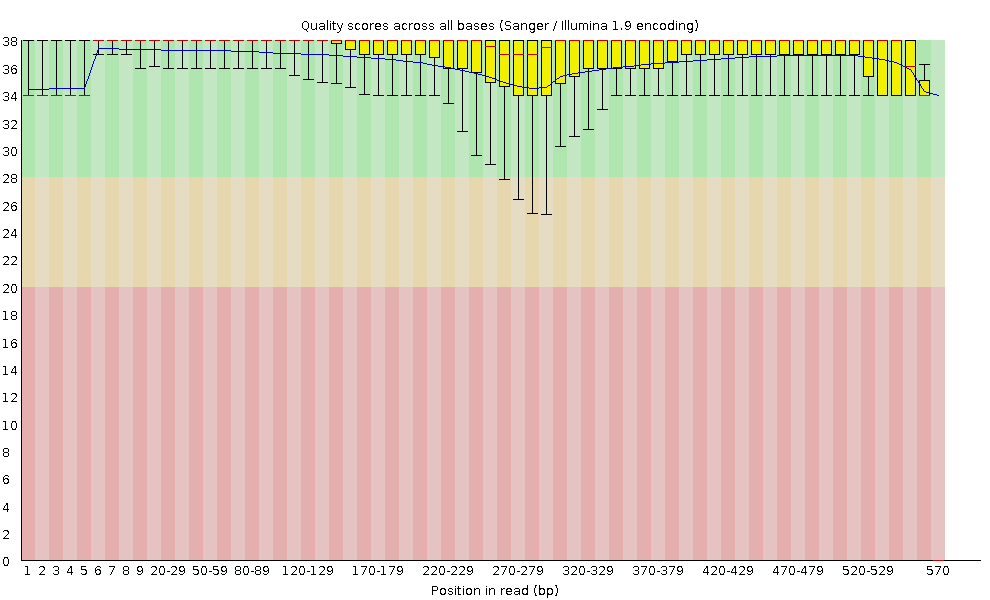

## EE filter and quality trimming

Before EE:


After EE:




EE filter drops over 1m reads.

## quality trimming

ILLUMINACLIP:ref/adapters.fa:2:30:10 LEADING:3 TRAILING:3 SLIDINGWINDOW:8:28 MINLEN:100

This is very strict.

Input Reads: 3314282 Surviving: 2681906 (80.92%) Dropped: 632376 (19.08%)


More reads survive, but you're clipping (selecting shorter reads)


You see the same effect even with less strict settings with respect to length (SLIDINGWINDOW:4:15):


## merging notes

bbmerge and flash output a comparable amount of joined reads with comparable expected error rates


# metaspades

```
0:00:00.000     4M / 4M    ERROR   General                 (launch.hpp                :  32)   Sorry, current version of metaSPAdes can work with single library only (paired-end only).

== Error ==  system call for: ['/people/brow015/anaconda3/share/spades-3.9.0-0/bin/spades', '/pic/projects/mint/atlas/results/test-experiment/decon/ttttt/K21/configs/config.info', '/pic/projects/mint/atlas/results/test-experiment/decon/ttttt/K21/configs/mda_mode.info', '/pic/projects/mint/atlas/results/test-experiment/decon/ttttt/K21/configs/meta_mode.info'] finished abnormally, err code: 239
```

# RefSeq

```
sqlite> .open refseq78.complete.nonredundant_protein.faa.db
sqlite> .mode tabs
sqlite> create table refseq (name text PRIMARY KEY, function text, taxonomy text);
sqlite> .import refseq78.complete.nonredundant_protein.faa.map refseq
```

# EGGNOG

```
sqlite> .open eggnog4_nonredundant.db
sqlite> .mode tabs
sqlite> create table eggnog (uniprot_ac text, eggnog_ssid_b text PRIMARY KEY, eggnog_species_id text, uniprot_id text, cog_func_id text, cog_id text, cog_product text, cog_level1_code text, cog_level1_name text, cog_level2_name text, cazy_id1 text, cazy_id2 text, cazy_class text, cazy_clan text, cazy_product text, cazy_gene_id text, cazy_taxa text, cazy_ec text, ko_id text, ko_level1_name text, ko_level2_name text, ko_level3_id text, ko_level3_name text, ko_gene_symbol text, ko_product text, ko_ec text);
sqlite> .import eggnog4_nonredundant.map eggnog
```

# EXPAZY

```
sqlite> .open expazy.db
sqlite> .mode tabs
sqlite> create table expazy (uniparc_entry text PRIMARY KEY, uniprot_entry text, expazy_ec text, expazy_name text);
sqlite> .import expazy.map expazy
```

# DBCAN

```
sqlite> .open dbcan.db
sqlite> .mode tabs
sqlite> create table dbcan (cazy_gene text PRIMARY KEY, cazy_family text, cazy_class text, cazy_ec text);
sqlite> .import dbcan.map dbcan
```
